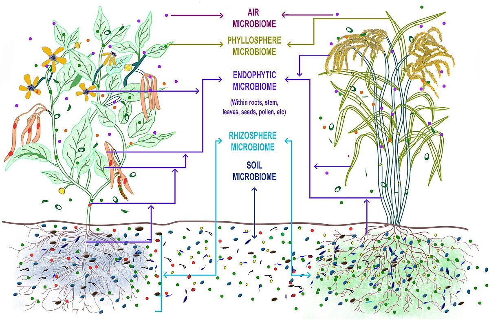

# Data-management-Engineering

Этот репозиторий содержит основной ETL-пайплайн для извлечения, трансформации и загрузки данных.

## Набор данных




Этот ETL-пайплайн обрабатывает набор данных метабаркодинга генов 16S и ITS2, связанных с анализом микробного разнообразия озимых зерновых культур (рожь, пшеница и тритикале). Понимание микробного разнообразия растений позволит в будущем манипулировать составом их микробиома для повышения урожайности и устойчивости к неблагоприятным факторам среды сельскохозяйственных культур. Наобор данных был получен из лаборатории инфекционных заболеваний растений КИББ Фиц КазНЦ РАН, образцы были секвенированы на Illumina MiSeq.

Данные состоят из нескольких файлов, включая таблицы подсчета ASV (Amplicon Sequence Variants), таксономическую классификацию и метаданные образцов.

---

## Источник данных

Все исходные "сырые" данные для этого проекта хранятся на Google Drive.

**Ссылка на Google Drive:** [https://drive.google.com/drive/folders/1Azl5tjFB47B9aBVfpBObkG4WG7ohekdS?usp=sharing](https://drive.google.com/drive/folders/1Azl5tjFB47B9aBVfpBObkG4WG7ohekdS?usp=sharing)

---

## Основной ETL-пайплайн

Пакет `etl` представляет собой конвейер для извлечения, трансформации и загрузки набора геномных данных.

### Структура пакета `etl/`

```
Data-management-Engineering/
│
├── etl/
│   ├── __init__.py
│   ├── extract.py     # Extract from GDrive
│   ├── load.py        # Load to DB
│   ├── main.py        # The main executable file
│   └── transform.py   # Type conversion
│
├── my_project/        # Working directory
│   ├── data          
│   │   ├── processed
│   │   └── raw
│   ├── notebooks
│   │    └── EDA.ipynb    
│   ├── poetry.lock
│   ├── pyproject.toml
│   │
│   └── archieve
│       ├── api_example
│       │   ├── api_reader.py
│       │   └── processed
│       │       └── jokes.csv
│       └── parse_example
│           ├── data_parser.py
│           └── processed
│               └── population.csv
├── .gitignore
└── README.md
```

### Инструкция по запуску

Для запуска полного ETL-процесса необходимо:

Для запуска пайплайна необходимо сначала настроить окружение, а затем запустить сам скрипт.

#### Запуск ETL

```bash
# 1. Клонируйте репозиторий
git clone git@github.com:Konstantaza/Data-management-Engineering.git
cd Data-management-Engineering

# 2. Создайте окружение conda 
conda create -n my_env python=3.13 pip

# 3. Активируйте окружение
conda activate my_env

# 4. Установите Poetry
pip install poetry

# 5. Перейдите в папку проекта и установите все зависимости
cd my_project
poetry install

# 6. Запустите пайплайн
poetry run python ../etl/main.py --step all

```

### Дополнительные примеры
В папке `my_project/archive` находятся дополнительные скрипты, демонстрирующие:
1. `api_example`: Пример работы с API (получение данных о шутках).
2. `parse_example`: Пример парсинга HTML-таблиц с веб-страниц.

