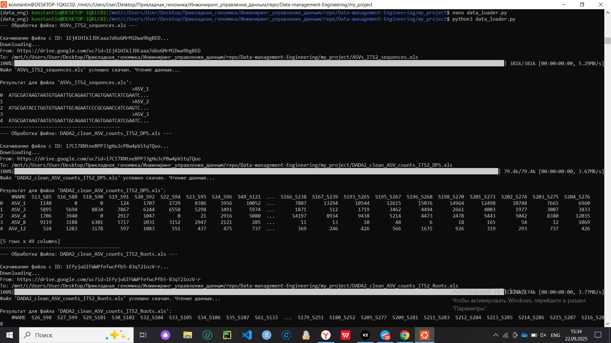

Этот проект содержит скрипт для загрузки набора данных из Google Drive.

## Как запустить

1.  Клонируйте репозиторий - git clone
2.  Создайте окружение 
    conda create -n my_env python=3.13 pip
    conda activate my_env
3.  Установите Poetry
    pip install poetry
    Создайте директорию
    poetry new my_project
4.  Выполните команды в директории для установки зависимостей
    cd my_project
    poetry add jupyterlab pandas matplotlib gdown openpyxl xlrd wget
    poetry install --no-root
5.  Запустите скрипт командой 
    python3 data_loader.py    

## Результат выполнения скрипта

Ниже представлен скриншот вывода первых строк загруженных данных.

(Screen_2.jpg)(Screen_1.jpg)